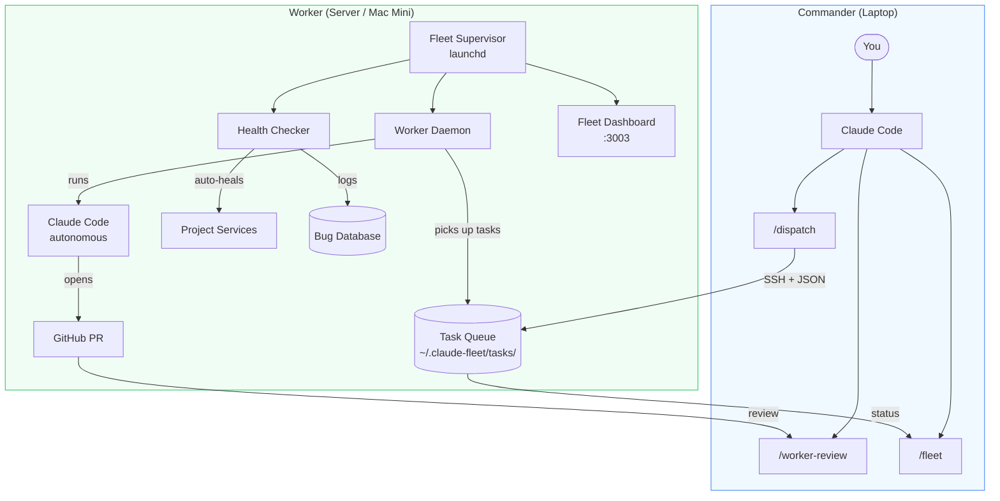
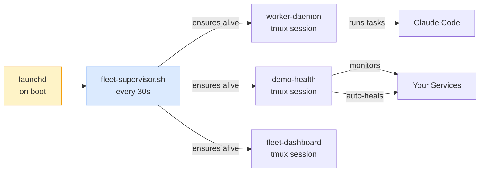
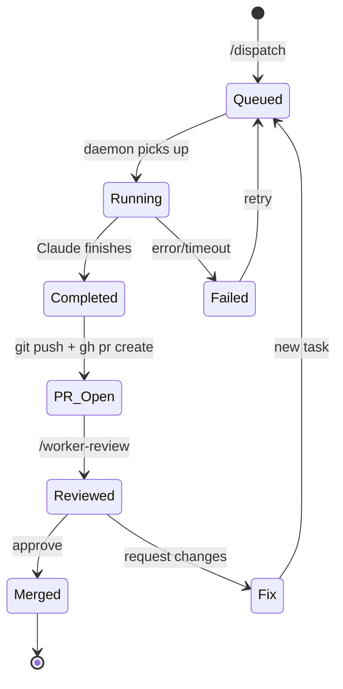
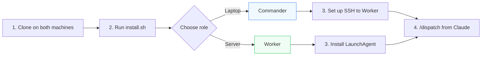

# claude-handler

A framework that turns [Claude Code](https://docs.anthropic.com/en/docs/claude-code) into a Technical Co-Founder — and optionally runs a fleet of autonomous AI workers across multiple machines.

**Single machine:** Install in 30 seconds. Claude gets a product-focused persona, smart project onboarding, and session continuity across every project.

**Two machines:** Add a Worker (Mac Mini, server, any always-on machine). Dispatch heavy tasks from your laptop. The Worker runs Claude autonomously, opens PRs, sends email notifications, and auto-heals crashed services — while you sleep.

## What You Get

| Feature | Description |
|---------|-------------|
| **Technical Co-Founder persona** | Claude pushes back on bad ideas, thinks product-first, ships incrementally |
| **Smart onboarding** | Auto-detects tech stack, git history, file structure — only asks what it can't figure out |
| **Personalisation** | `/cofounder` runs an interview, saves your profile. Claude remembers your preferences |
| **CLAUDE.md generation** | Creates per-project context files so future sessions start instantly |
| **Dual-machine fleet** | Commander dispatches tasks, Worker executes autonomously |
| **Process supervision** | LaunchAgent keeps services alive across reboots |
| **Health checking** | Auto-detects crashes, scans logs, creates bug database, auto-heals known issues |
| **Email notifications** | Gmail alerts for task completion/failure with reply-to-action |
| **Notion integration** | 10 slash commands for documentation management |

## Architecture



## Process Supervision

The Worker machine uses macOS LaunchAgent to keep everything running:



## Task Lifecycle

From dispatch to merged PR:



## Quick Start

### Single Machine (Commander only)

```bash
git clone https://github.com/doyun-gu/claude-handler.git ~/claude-handler
cd ~/claude-handler
./install.sh    # Choose "Commander" when prompted
```

Restart Claude Code. You'll see:

> *Tip: run `/cofounder` to personalise how I work with you.*

Run `/cofounder` for a 2-minute interview that configures Claude's explanation depth, pushback level, and tool preferences.

### Two Machines (Commander + Worker)



**On your laptop (Commander):**
```bash
git clone https://github.com/doyun-gu/claude-handler.git ~/claude-handler
cd ~/claude-handler
./install.sh    # Choose "Commander"
```

**On your server (Worker):**
```bash
git clone https://github.com/doyun-gu/claude-handler.git ~/claude-handler
cd ~/claude-handler
./install.sh    # Choose "Worker", install LaunchAgent
```

**Connect them** — add to `~/.ssh/config` on Commander:
```
Host worker
  HostName <worker-ip>
  User <username>
```

**Dispatch your first task:**
```
> /dispatch
"Add comprehensive tests for the auth module"
```

The Worker picks it up, runs Claude autonomously, opens a PR, and notifies you by email.

## Setup Flow

```
                              clone repo
                                  │
                            ./install.sh
                                  │
                        ┌─────────┴─────────┐
                        │                     │
                   Commander              Worker
                        │                     │
                  Claude Code           LaunchAgent
                  /cofounder            fleet-supervisor
                  /dispatch ──────────► worker-daemon
                  /worker-review ◄──── health-checker
                        │             fleet-dashboard
                     SSH setup
                        │
                   Ready to go
```

## Commands

### Core

| Command | Description |
|---------|------------|
| `/cofounder` | Personalisation interview — saves to `~/.claude/user-profile.md` |
| `/startup` | Re-run session orientation. Refreshes context |
| `/onboard` | Force full onboarding (regenerate CLAUDE.md) |
| `/ready2modify` | Sync repo on a new machine |
| `/workdone` | Save and push before switching machines |

### Fleet (Commander)

| Command | Description |
|---------|------------|
| `/fleet` | Cross-project dashboard — tasks, PRs, sync state |
| `/dispatch` | Send a task to the Worker |
| `/dispatch @project` | Target a specific project |
| `/worker-status` | Check Worker task progress |
| `/worker-review` | Review and merge completed Worker PRs |

### Notion (optional)

| Command | Description |
|---------|------------|
| `/notion-sync` | Sync Notion ↔ local markdown |
| `/notion-progress` | Log git commits to Notion |
| `/notion-done` | End-of-session handoff |
| `/notion-status` | Status report from Notion |
| `/notion-decision` | Log a technical decision |
| `/notion-milestone` | Add/update a milestone |
| `/notion-doc` | Create a documentation page |
| `/notion-search` | Search the workspace |
| `/notion-review` | Audit docs for quality |
| `/notion-lecture` | Create a lecture note |

## Configuration

All config lives in `~/.claude-fleet/`. See `config.example/` for format reference.

| File | Purpose |
|------|---------|
| `machine-role.conf` | Commander or Worker role |
| `projects.json` | Registered projects and their services |
| `secrets/gmail.conf` | Gmail credentials for notifications |

### Email Notifications

The Worker sends styled HTML emails for task completions and failures. Reply to take action:

| Reply | Action |
|-------|--------|
| `merge` | Squash merge the PR |
| `fix: [description]` | Create a fix task |
| `skip` | Close PR, move on |
| `queue: [task]` | Queue a new task |

Setup: copy `config.example/gmail.conf.example` to `~/.claude-fleet/secrets/gmail.conf` and add your [Gmail App Password](https://myaccount.google.com/apppasswords).

### Projects Registry

Edit `~/.claude-fleet/projects.json` to register your projects. Each project can define services that the health checker monitors and auto-restarts:

```json
{
  "projects": [{
    "name": "my-app",
    "path": "~/Developer/my-app",
    "repo": "https://github.com/you/my-app.git",
    "services": [{
      "name": "api",
      "port": 8000,
      "start_cmd": "python -m uvicorn main:app --port 8000",
      "health_url": "http://localhost:8000/health"
    }]
  }]
}
```

## File Structure

```
claude-handler/
├── install.sh                 # Interactive installer (Commander/Worker)
├── install-launchd.sh         # Generate and install LaunchAgent
├── uninstall.sh               # Remove symlinks, restore backups
├── worker-daemon.sh           # Autonomous task runner
├── fleet-startup.sh           # Boot-time service launcher
├── fleet-supervisor.sh        # Process supervisor (keeps tmux alive)
├── demo-healthcheck.sh        # Service health + log scanning + auto-heal
├── fleet-notify.sh            # Gmail notifications + reply-to-action
├── fleet-brain.py             # Task scheduling + PR management
├── queue-manager.py           # Smart task queue with priorities
├── sync-to-macbook.sh         # Sync to a second machine
├── config.example/            # Example configs (safe to commit)
│   ├── projects.json.example
│   ├── machine-role.conf.example
│   └── gmail.conf.example
├── launchd/
│   ├── com.fleet.supervisor.plist           # Generated (gitignored)
│   └── com.fleet.supervisor.plist.template  # Template with __HOME__ markers
├── dashboard/
│   ├── api.py                 # FastAPI fleet dashboard backend
│   └── index.html             # Dashboard frontend
├── global/
│   ├── CLAUDE.md              # Core persona + startup protocol
│   └── commands/              # Slash commands (symlinked to ~/.claude/)
├── notion/                    # Notion integration (optional)
│   ├── commands/              # 10 Notion slash commands
│   ├── templates/             # Document format definitions
│   └── schemas/               # Database schemas
├── handoff/                   # Sleep/wake sync between machines
└── templates/
    └── project-claude-md.md   # CLAUDE.md generation template
```

## How It Works

Claude Code loads `~/.claude/CLAUDE.md` at the start of every session. This framework symlinks its own `CLAUDE.md` there, giving Claude a product-focused persona and smart onboarding protocol.

**Session flow:**

| Project State | What Happens |
|--------------|-------------|
| New (empty dir) | Full onboarding: asks product idea, target user, tech preferences |
| Existing (has code, no CLAUDE.md) | Auto-scans project, asks only unknowable things |
| Returning (has CLAUDE.md) | Reads it, says "Ready to work" |

**Worker flow:**

1. Commander runs `/dispatch "build feature X"`
2. Task JSON is created in `~/.claude-fleet/tasks/`
3. Worker daemon picks it up, creates a `worker/` branch
4. Claude runs autonomously (up to 200 turns)
5. Worker pushes branch, opens PR, writes summary
6. Commander gets notified, runs `/worker-review` to merge

## Customising

**Edit the persona:** Modify `global/CLAUDE.md` — changes apply instantly via symlink.

**Add commands:** Create `.md` files in `global/commands/` and re-run `./install.sh`.

**Notion setup:** See [notion/README.md](notion/README.md) for MCP server setup.

## Uninstall

```bash
./uninstall.sh
```

Removes symlinks and restores backups. Fleet data in `~/.claude-fleet/` is preserved.

## Author

Created by [Doyun Gu](https://github.com/doyun-gu)

## License

MIT — see [LICENSE](LICENSE)
