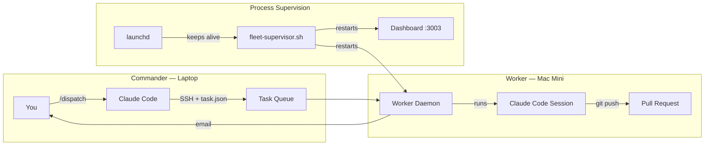
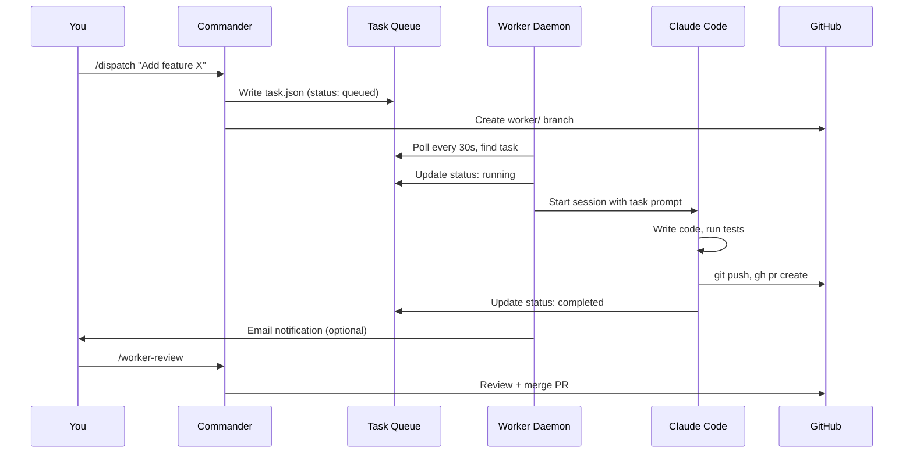
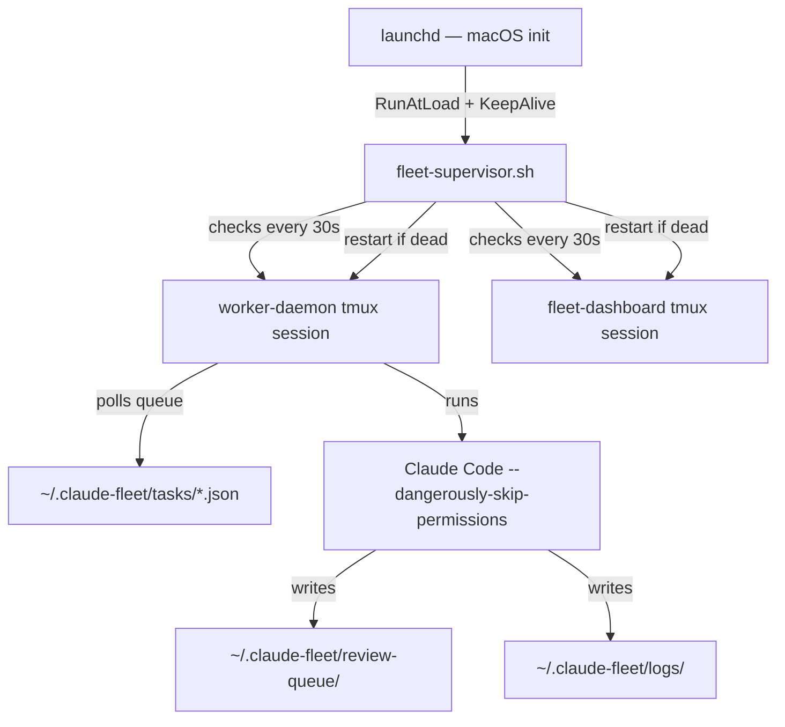

# claude-handler

**Turn any Mac Mini into an autonomous AI development worker.**

Dispatch tasks from your laptop. A Worker machine picks them up, writes code, opens PRs, and emails you when done. All powered by Claude Code.

```
You (laptop):  /dispatch "Add dark mode to the settings page"
               ↓
Mac Mini:      Picks up task → writes code → runs tests → opens PR
               ↓
You:           Review PR → merge → done
```

## Quick Start

```bash
git clone https://github.com/YOUR_USERNAME/claude-handler.git ~/claude-handler
cd ~/claude-handler
./install.sh
```

The installer asks a few questions (role, projects, optional Worker machine) and sets everything up. Or just open Claude Code in the repo — it'll walk you through setup interactively.

## What You Get

| Feature | Description |
|---------|-------------|
| **Autonomous Worker** | Daemon watches a task queue, runs Claude Code sessions back-to-back |
| **Process supervision** | launchd keeps the Worker alive across reboots |
| **Smart scheduling** | Priority queue with topic affinity and parallel project support |
| **PR workflow** | Worker creates branches, commits, opens PRs — never pushes to main |
| **Email notifications** | Get notified when tasks complete or fail (Gmail, optional) |
| **Fleet dashboard** | Web UI at `:3003` showing tasks, services, and system health |
| **20+ slash commands** | `/dispatch`, `/queue`, `/worker-review`, `/cofounder`, and more |
| **Technical Co-Founder** | Claude persona that pushes back on bad ideas and thinks product-first |
| **Smart onboarding** | Auto-detects your project's tech stack, asks only what it can't figure out |
| **Notion integration** | 10 commands for syncing work to Notion (optional) |

## Architecture



## How It Works

### Task Lifecycle



### Process Supervision



## Setup Options

### Hybrid (Single Machine)

One machine does everything. Good for getting started.

```bash
./install.sh   # Choose option 3 (hybrid)
```

### Commander + Worker (Two Machines)

Your laptop dispatches, a second machine executes.

**On the Worker (Mac Mini):**
```bash
git clone https://github.com/YOUR_USERNAME/claude-handler.git ~/claude-handler
cd ~/claude-handler
./install.sh   # Choose option 2 (worker)
```

**On the Commander (Laptop):**
```bash
git clone https://github.com/YOUR_USERNAME/claude-handler.git ~/claude-handler
cd ~/claude-handler
./install.sh   # Choose option 1 (commander), enter Worker SSH hostname
```

## Commands

### Fleet Management

| Command | Description |
|---------|-------------|
| `/dispatch "task"` | Send a task to the Worker |
| `/dispatch @project "task"` | Target a specific project |
| `/queue` | Worker server dashboard — system, tasks, services |
| `/worker-status` | Check progress of running tasks |
| `/worker-review` | Review and merge completed Worker PRs |
| `/fleet` | Cross-project dashboard |

### Core

| Command | Description |
|---------|-------------|
| `/cofounder` | Personalise Claude's behaviour (explanation depth, pushback level, etc.) |
| `/startup` | Re-run session orientation |
| `/onboard` | Force full project onboarding |
| `/ready2modify` | Sync repo when switching machines |
| `/workdone` | Save and push before switching machines |

### Notion (optional)

| Command | Description |
|---------|-------------|
| `/notion-sync` | Sync Notion with local markdown |
| `/notion-progress` | Log today's work to Notion |
| `/notion-done` | End-of-session handoff |
| `/notion-status` | Project status from Notion |
| `/notion-decision` | Log a technical decision |

See [notion/README.md](notion/README.md) for Notion MCP setup.

## File Layout

```
claude-handler/
├── install.sh                 # Interactive installer
├── uninstall.sh               # Clean uninstall
├── worker-daemon.sh           # Core: autonomous task runner
├── fleet-supervisor.sh        # Keeps daemon alive
├── fleet-startup.sh           # Boot-time service starter
├── fleet-brain.py             # Smart queue manager
├── fleet-notify.sh            # Email notifications
├── fleet-rules.md             # Operational rules
├── dashboard/                 # Web UI (:3003)
├── global/
│   ├── CLAUDE.md              # Technical Co-Founder persona
│   └── commands/              # Slash commands
├── notion/                    # Notion integration
├── templates/                 # Config templates + examples
├── launchd/                   # macOS LaunchAgent plist
└── handoff/                   # Sleep/wake machine sync
```

## Requirements

- **macOS** (required for launchd process supervision; Claude Code + commands work on Linux)
- **Claude Code** — [install guide](https://docs.anthropic.com/en/docs/claude-code)
- **Git** and **GitHub CLI** (`brew install gh`)
- **tmux** (`brew install tmux`)
- **Python 3.9+** (for queue manager and dashboard)
- **Second machine** (optional — Hybrid mode works on a single machine)

## FAQ

**How much does this cost?**
Claude Code usage costs. The Worker runs `claude --dangerously-skip-permissions` which uses your Anthropic API credits or Claude Code subscription. Typical task: 5-30 minutes of Claude time.

**Is this secure?**
The Worker runs with `--dangerously-skip-permissions` for autonomy. Only run it on machines you trust. Secrets are stored in `~/.claude-fleet/secrets/` with 600 permissions. Worker never pushes to main — it opens PRs.

**Does it work on Linux?**
Claude Code integration (persona, commands, onboarding) works on Linux. Process supervision uses macOS launchd — on Linux, you'd set up systemd units manually. The daemon and scripts themselves are bash and work cross-platform.

**Can I use it without a second machine?**
Yes. Hybrid mode runs Commander + Worker on the same machine. You dispatch tasks and they run locally in a tmux session.

**How do I add projects?**
Edit `~/.claude-fleet/projects.json` or use `/dispatch @project-name "task"` which auto-registers new projects.

**What if a task fails?**
The daemon retries up to 3 times. After that, it writes to the review queue and optionally emails you. Run `/worker-review` to see failures and decide next steps.

## Uninstall

```bash
./uninstall.sh
```

Stops services, unloads launchd, removes symlinks, and optionally deletes `~/.claude-fleet/`.

## License

MIT — see [LICENSE](LICENSE)
