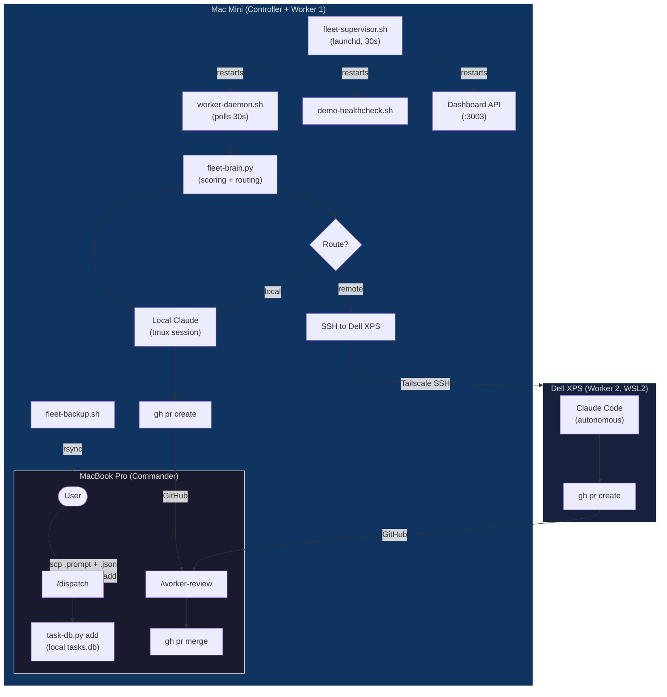
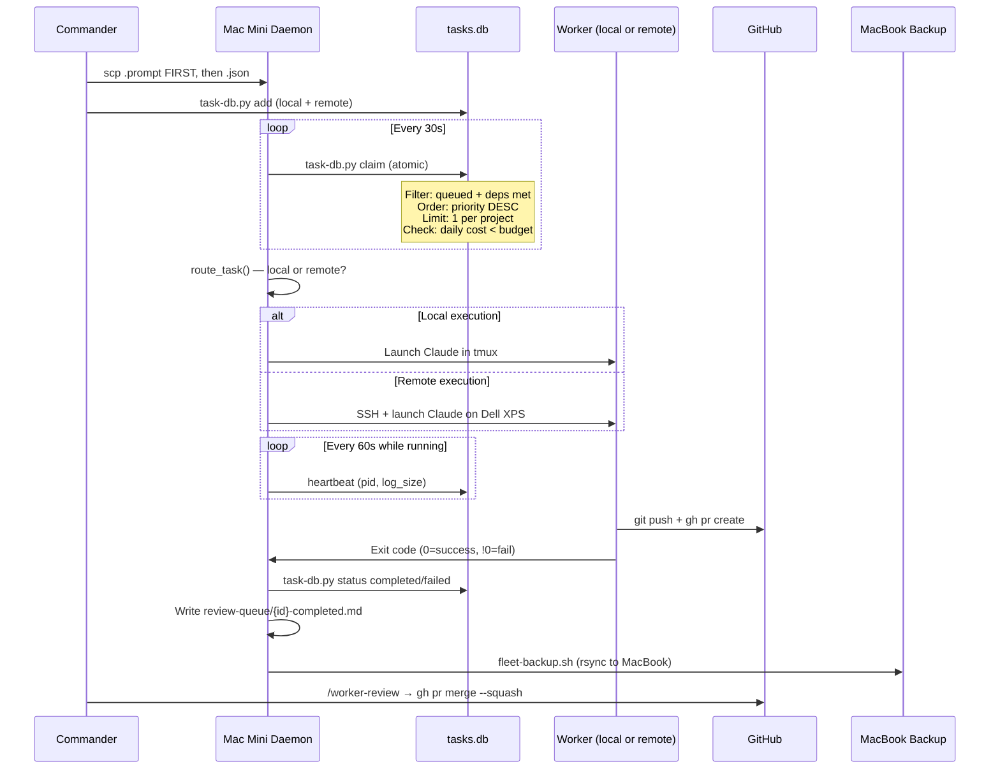
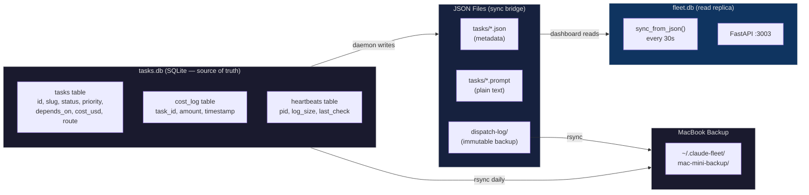
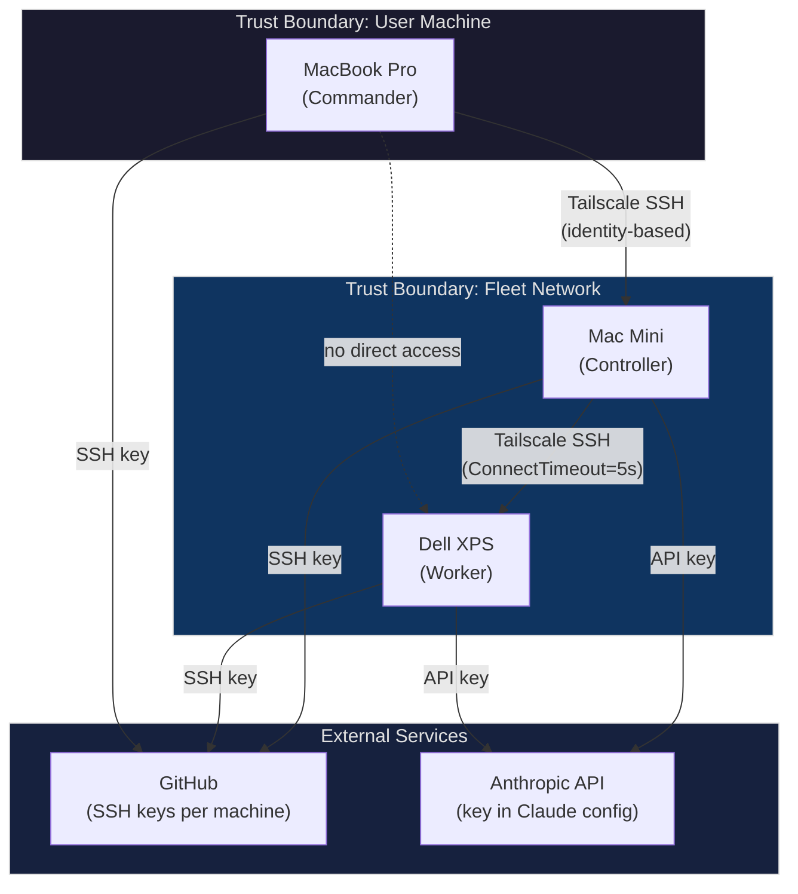
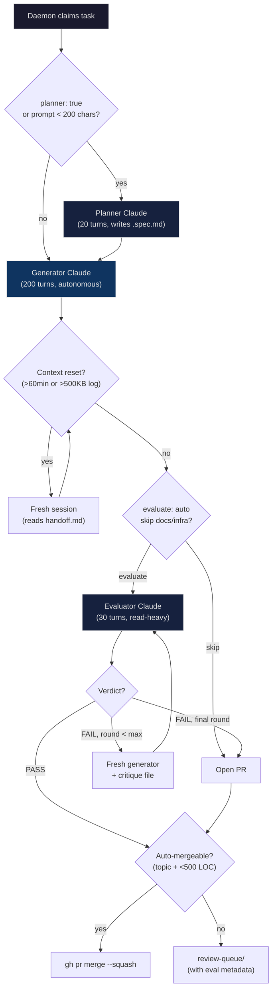
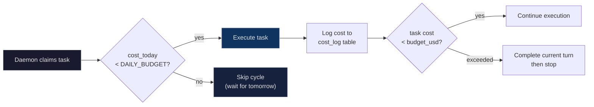

# Fleet Architecture

How the claude-handler fleet system orchestrates autonomous Claude Code sessions across multiple machines.

## Table of Contents

1. [System Overview](#system-overview)
2. [Task Lifecycle](#task-lifecycle)
3. [Data Architecture](#data-architecture)
4. [Security Model](#security-model)
5. [Failure Modes and Recovery](#failure-modes-and-recovery)
6. [Evaluator Pipeline](#evaluator-pipeline)
7. [Cost Model](#cost-model)

---

## System Overview

Star topology with single controller. Mac Mini is the hub — it owns the task queue, runs the daemon, and routes work to remote workers. Commander (MacBook) dispatches tasks and reviews PRs. Workers execute autonomously and never touch `main`.

**Why star, not mesh:** One queue, one DB, one source of truth. Adding a machine = one SSH config line. The bottleneck is Claude API throughput, not local orchestration.

---

## Task Lifecycle

**Status transitions:** `queued` → `running` → `completed`/`failed` → `merged` (after PR merge). Tasks can also be `blocked` (Worker writes to review queue) or `cancelled` (Commander intervention).

---

## Data Architecture

| Store | Location | Writer | Reader | Purpose |
|-------|----------|--------|--------|---------|
| `tasks.db` | Mac Mini | daemon, task-db.py | daemon, CLI | Source of truth for task state |
| `fleet.db` | Mac Mini | dashboard sync | FastAPI | Read-only replica for dashboard |
| `tasks/*.json` | Mac Mini | daemon, dispatch | dashboard, CLI | Human-readable manifests |
| `tasks/*.prompt` | Mac Mini | dispatch (scp) | daemon | Task instructions (plain text) |
| `dispatch-log/` | Both | dispatch | audit | Immutable backup of every dispatch |
| `review-queue/` | Mac Mini | daemon/worker | Commander startup | Async feedback channel |
| `bug-db.json` | Mac Mini | healthcheck | healthcheck | Recurring error tracker |

---

## Security Model

| Layer | Mechanism |
|-------|-----------|
| **Network** | Tailscale mesh VPN — all traffic encrypted, identity-based SSH (no password auth) |
| **Secrets** | `~/.claude-fleet/` never committed. API keys in Claude config, not fleet config. Gmail app password in `gmail.conf` (gitignored) |
| **Error masking** | All daemon errors logged as `[D-XXX]` codes. No stack traces in review queue. Sensitive output never logged |
| **Input validation** | Task JSON parsed and validated before dispatch. Prompt files checked non-empty. Branch names slugified. Project paths must exist |
| **Isolation** | Workers use `worker/*` branches only. No write access to `main`. One machine, one branch — no conflicts |
| **Least privilege** | Workers: SSH to GitHub + Anthropic API only. Controller: SSH to workers. Commander: SSH to controller only |

---

## Failure Modes and Recovery

| Failure | Detection | Recovery | Error Code |
|---------|-----------|----------|------------|
| **Mac Mini down** | MacBook SSH timeout | Tasks stay queued. Backup on MacBook has tasks.db copy. Restart supervisor via launchd | — |
| **Dell XPS unreachable** | `ssh -o ConnectTimeout=5s` fails | Task re-routes to local Mac Mini execution | D-040 |
| **Daemon crash** | Heartbeat file stale (<60s since last write) | `fleet-supervisor.sh` restarts tmux session within 30s | D-010 |
| **Crash loop** | 5 crashes in 5 minutes | Daemon writes `daemon-crash-loop-blocked.md` to review queue and stops | D-011 |
| **Task stuck** | Heartbeat stale, or exceeds 2h timeout (`TASK_TIMEOUT=7200`) | Daemon kills process, marks `failed`, retries up to `max_retries=3` | D-030 |
| **Task fails** | Claude exit code != 0 | Daemon marks `failed`, writes `{id}-failed.md` to review queue. Auto-retry if retries remaining | D-050 |
| **Disk full** | Write failures to tasks.db or log files | Daemon logs error, skips task. `fleet-backup.sh` prunes logs >7 days | D-060 |
| **GitHub unreachable** | `gh pr create` fails | PR creation retried next cycle. Task marked completed (code is on branch) | D-041 |
| **SQLite corrupt** | task-db.py errors | Falls back to JSON file scanning via fleet-brain.py | D-020 |
| **Service down** | `demo-healthcheck.sh` port checks (60s interval) | Auto-restart: clears cache, kills port, restarts process. 3 attempts then 5-cycle backoff | — |

---

## Evaluator Pipeline

Independent Claude session grades the generator's work, eliminating self-evaluation bias.

| Stage | Turns | Purpose | Output |
|-------|-------|---------|--------|
| **Planner** | 20 max | Structured planning for short/vague prompts | `.spec.md` |
| **Generator** | 200 max | Full implementation with commits | Git branch + PR |
| **Evaluator** | 30 max | Independent review against `eval-criteria/{type}.md` | `{"verdict": "PASS"/"FAIL", "score": 0-100, "issues": [...]}` |
| **Retry** | 200 max | Fresh generator with critique from evaluator | Updated branch |

**Auto-merge policy:** Tasks with topics `docs`, `infra`, or `test` + diff under 500 lines merge automatically. Features, UI changes, and refactors always go to Commander review.

---

## Cost Model

| Control | Default | Scope |
|---------|---------|-------|
| `DAILY_BUDGET` | $50/day | Per-machine |
| `budget_usd` | $5/task | Per-task (in manifest JSON) |
| Duration estimate | Weighted by topic affinity + project history | Per-task |
| Planner overhead | +5-10 min estimated | Added when `planner: true` |
| Evaluator overhead | +10-15 min per round | Added when `evaluate: auto` |

**Estimation algorithm** (fleet-brain.py): Completed tasks with timestamps → weighted average by topic affinity (0.2) + same project (0.3) + base (0.5). Combined tasks scale by sub-task count with diminishing returns (`count * 0.7`, capped at 3x).
