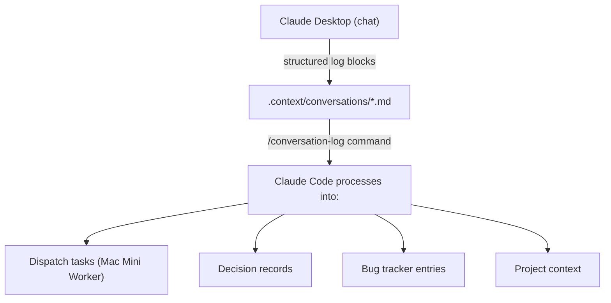

# Conversation Logging — Claude Desktop → Claude Code Pipeline

## Overview

Every conversation you have in Claude Desktop can feed directly into the development pipeline. No information is lost between tools.



## Setup (5 minutes, per project)

### 1. Claude Desktop Project Instructions

Open Claude Desktop → Your Project → Custom Instructions → Paste from:
`templates/claude-desktop-project-instructions.md`

Replace `{PROJECT_NAME}` with your project name.

### 2. Create the Conversation Directory

In your project root:
```bash
mkdir -p .context/conversations
```

### 3. Start Logging

During any Claude Desktop chat:
- Discuss features, bugs, strategy, architecture
- Say **"save"** or **"log this"** at any point
- Claude generates a structured block with tagged items
- Copy the block → paste into `.context/conversations/{date}-{topic}.md`

### 4. Process in Claude Code

```bash
/conversation-log
```

This scans all conversation logs and:
- Creates dispatch tasks for `[TASK]` items
- Appends `[DECISION]` items to `.context/decisions.md`
- Adds `[BUG]` items to `DEBUG_DETECTOR.md`
- Shows unanswered `[QUESTION]` items

## Tag Reference

| Tag | When to Use | Where it Goes |
|-----|-------------|---------------|
| `[DECISION]` | Architecture, product, or strategy choice | `.context/decisions.md` |
| `[TASK]` | Something to build, fix, or improve | Mac Mini task queue |
| `[INSIGHT]` | Learning, observation, competitive intelligence | `.context/conversations/` (stays in log) |
| `[QUESTION]` | Needs investigation or research | Surfaced by `/conversation-log` |
| `[BUG]` | Bug identified during discussion | `DEBUG_DETECTOR.md` |
| `[NOTE]` | General note worth keeping | `.context/conversations/` (stays in log) |

## Example Conversation Log

```markdown
## 2026-03-19 — Supervisor feedback on IEEE bus visualization

### Decisions
- [DECISION] Use PowerWorld-style animated dashes for power flow, not particle effects — supervisor prefers professional look over flashy
- [DECISION] Prioritize IEEE 14-bus demo for dissertation, 118-bus is nice-to-have

### Tasks
- [TASK] Add loading progress bar for PV curve on large networks — P1
- [TASK] Implement PDF report export for power flow results — P1
- [TASK] Add comparison mode: show DP vs EMT results side-by-side — P2

### Insights
- [INSIGHT] Supervisor mentioned PSCAD has a "channel export" feature that researchers love — investigate if we can do something similar
- [INSIGHT] The 3-bus waveform comparison was the most impressive part of the demo to the supervisor

### Questions
- [QUESTION] Should we support PSS/E RAW format import? Supervisor's students use it.

### Bugs
- [BUG] N-1 contingency crashes on 118-bus system — critical
```

## Applying to All Projects

This system works for ANY project. The `/architecture` command auto-creates the `.context/conversations/` directory when setting up a project.

### Projects that use this:
- **DPSpice-com** — product decisions, feature planning, supervisor feedback
- **claude-handler** — framework improvements, command design
- **my-world** — environment setup decisions
- **project-JULY** — firmware/PCB design decisions
- **study-with-claude** — learning notes, concept explanations

## Automation Ideas (Future)

- **Auto-paste from clipboard:** A keyboard shortcut that saves clipboard content to `.context/conversations/` with auto-generated filename
- **Claude Desktop API:** When Anthropic releases a Desktop API, auto-sync conversations without manual copy-paste
- **Watch folder:** A file watcher that auto-processes new conversation logs when they appear
