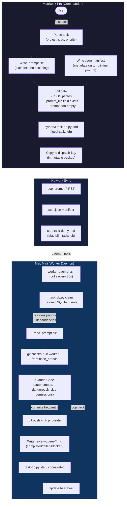
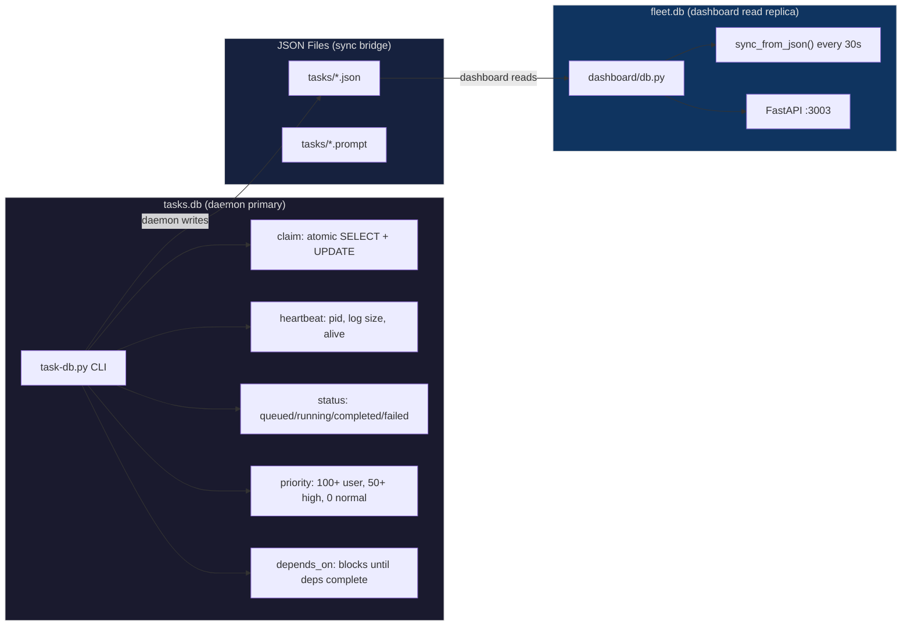
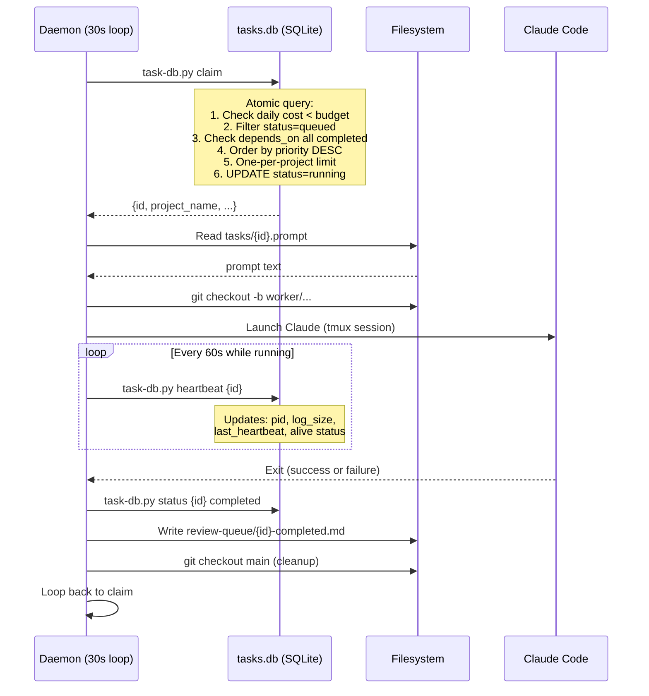
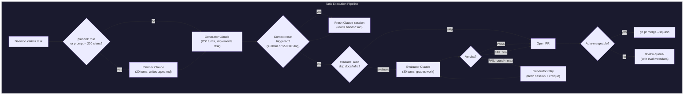

# Dispatch and Daemon Architecture

How tasks flow from Commander to Worker, get claimed, executed, and reported back.

## Dispatch Flow



## Data Layer



## Task File Format

Each dispatched task consists of **two files** in `~/.claude-fleet/tasks/`:

### JSON Manifest (`<task-id>.json`)

```json
{
  "id": "20260325-143000-feature-slug",
  "slug": "feature-slug",
  "branch": "worker/feature-slug-20260325",
  "project_name": "DPSpice-com",
  "project_path": "/Users/<username>/Developer/my-project",
  "status": "queued",
  "base_branch": "main",
  "prompt_file": "20260325-143000-feature-slug.prompt",
  "budget_usd": 10,
  "max_turns": 200,
  "permission_mode": "dangerously-skip-permissions",
  "priority": 50,
  "depends_on": [],
  "group": "phase1-engine",
  "dispatched_at": "2026-03-25T14:30:00Z"
}
```

### Prompt File (`<task-id>.prompt`)

Plain text. Any length, any characters. No JSON escaping needed.

## Daemon Claiming Logic



## Priority System

| Priority | Level | When to use |
|----------|-------|-------------|
| `100+` | P0 | User-requested tasks (always run first) |
| `50-99` | P1 | High priority features |
| `10-49` | P2 | Normal queued tasks |
| `0-9` | P3 | Backlog, maintenance, auto-generated |

The daemon always picks the highest-priority queued task whose dependencies are met.

## Review Queue

When a task completes, the daemon writes to `~/.claude-fleet/review-queue/`:

| File | Meaning |
|------|---------|
| `{id}-completed.md` | PR ready for review |
| `{id}-failed.md` | Task crashed, check logs |
| `{id}-blocked.md` | Worker stuck, needs Commander |
| `{id}-decision.md` | Worker made a choice, wants confirmation |

Commander checks this on every session startup and surfaces items before the greeting.

## Evaluator Harness

After the generator completes, the daemon optionally runs an independent evaluator Claude session. This addresses self-evaluation bias (generators reliably praise their own work).



### Evaluator Details

| Aspect | Value |
|--------|-------|
| Max turns | 30 (evaluator is read-heavy, not write-heavy) |
| Max rounds | 2 (configurable via `max_eval_rounds` in task JSON) |
| Auto-skip | docs, readme, context, cleanup, lint, changelog tasks |
| Criteria | Loaded from `eval-criteria/{type}.md` based on task slug |
| Verdict format | JSON: `{"verdict": "PASS"/"FAIL", "score": 0-100, "issues": [...]}` |
| Critique file | `~/.claude-fleet/eval/{task_id}.critique-{round}.md` |
| For UI tasks | Evaluator uses /browse or /qa to verify visually |

### Task JSON Fields (all optional)

```json
{
  "evaluate": "auto",           // "true", "false", "auto" (default: "auto")
  "max_eval_rounds": 2,         // 1-3 (default: 2)
  "eval_criteria_type": "",     // override: "ui", "engine", "api", etc.
  "planner": false              // run planner before generator (default: false)
}
```

### Eval Error Codes

| Code | Description | Recovery |
|------|-------------|----------|
| D-070 | Evaluator session crashed | Skip evaluation, proceed to review |
| D-071 | Verdict file not found | Treat as UNKNOWN, proceed |
| D-072 | Verdict file malformed | Treat as UNKNOWN, proceed |
| D-073 | Generator retry failed | Mark eval as FAIL, proceed |

## Common Mistakes

1. **Missing `task-db.py add`** -- daemon cannot claim tasks not registered in SQLite
2. **Inline prompt in JSON** -- special characters break JSON silently, daemon rejects
3. **Forgetting to sync `.prompt` file** -- JSON arrives, daemon claims, but prompt is empty
4. **Wrong sync order** -- must scp `.prompt` BEFORE `.json` (daemon triggers on JSON)
5. **Missing `priority` field** -- defaults to 0, task runs last even if urgent
6. **Stale `running` status** -- after daemon restart, clean up with `task-db.py stuck`
